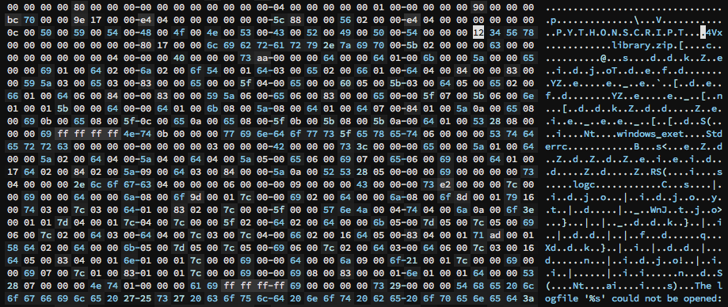
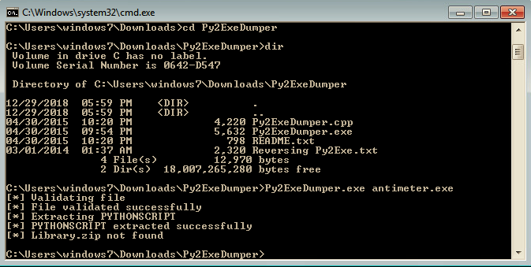

# Reversing Antimeter 2

Antimeter is a nifty tool for detecting meterpreter that I have found pretty useful when labbing and I was curious of the implementation behind its detection method.

I was thinking about methods of detecting meterpreter. The most primitive of which to check the memory usage (size) of a process as that could be indicative of reflective DLL injection; however, this is highly prone to false positives.

The program author states that it searches memory for meterpreter strings and that's when I decided to confirm.

----

Antimeter can be downloaded from [here](https://www.mertsarica.com/antimeter-tool/)

Once extracted, the package can be seen containing .pyd files and several other interesting files, such as:
* library.zip
* python26.dll
* antimeter.exe

antimeter.exe is to be run on a Windows system via command-line where it will scan in a specified time interval and can be run with either an auto-kill or meterpreter detection option.

I found it interesting that the package contained the python26.dll and doing an initial look at the strings of the binary antimeter.exe suggested a relation to python.

```
$ strings antimeter.exe | less
... strings continued above
C:\Python26\lib\site-packages\py2exe\boot_common.pyR
C:\Python26\lib\site-packages\py2exe\boot_common.pyR
__name__t
__module__t
softspaceR
syst
_MessageBoxt
executableR
C:\Python26\lib\site-packages\py2exe\boot_common.pyR
Blackholec
C:\Python26\lib\site-packages\py2exe\boot_common.pyR
C:\Python26\lib\site-packages\py2exe\boot_common.pyR
C:\Python26\lib\site-packages\py2exe\boot_common.pyR
... strings continued below
```

Some digging on the internet led me to py2exe and based on the layout of the package, antimeter seemed to fit.

For some background, py2exe is a tool used to convert python programs into Windows executables in order to run python code on Windows hosts without requiring python to be installed.

After finding out about py2exe, I wanted to know about the specifics. Is it the python byte code packaged with the python interpreter? That might explain the python26.dll. Or is it converted and compiled to native x86 machine code.

Wikipedia made the distinction clear "Although this program transforms a .py file to an .exe, it does not make it run faster as py2exe just bundles the Python bytecode rather than converting it to machine-code." (https://en.wikipedia.org/wiki/Py2exe)

Seeing as the python byte-code is packaged into the executable, then it might be possible to decompile it?

This link was most helpful (https://www.sdkhere.com/2017/07/reversing-of-python-built-exe.html)

The generated binary can be bundled to contain the python26.dll (the python interpreter), library.zip (zip file containing needed pyc files), and the PYTHONSCRIPT (compiled version of the python script AKA python byte code).

In this case, python26.dll and library.zip were not bundled into the binary (there are options in py2exe to choose whether or not to do that). So, we are concerned with extracting the PYTHONSCRIPT.

The important bytes can be seen in a hex dump following P Y T H O N S C R I P T and the magic number 0x12345678.

<!-- Insert image of python script section -->
<p align="center">  </p>

The PYTHONSCRIPT section was dumped using Py2ExeDumper (https://sourceforge.net/projects/py2exedumper/).

<p align="center">  </p>

Once dumped, the PYTHONSCRIPT is stored as marshalled (serialized) code objects as seen below.

```
[ <code object <module> at 0x100cc85b0, file "C:\Python26\lib\site-packages\py2exe\boot_common.py", line 44>,
 <code object <module> at 0x100cc86b0, file "antimeter.py", line 6> ]
```

In the resource I previously linked, there was a script for unmarshalling the PYTHONSCRIPT; however, it did not work initially so some modification was needed.

One such error that occurred was:

```
Traceback (most recent call last):
  File "badunmarshal.py", line 8, in <module>
    for i in range(0,len(ob)):
TypeError: object of type 'int' has no len()
```

This was fixed by applying the offset to skip the header bytes of library.zip as can be seen below:

<pre>
00000000: 1234 5678 0000 0000 0000 0000 8017 0000  .4Vx............
00000010: 6c69 6272 6172 792e 7a69 7000 5b02 0000  <b>library.zip</b>.[...
00000020: 0063 0000 0000 0000 0000 0400 0000 4000  .c............@.
00000030: 0000 73aa 0000 0064 0000 6401 006b 0000  ..s....d..d..k..
00000040: 5a00 0065 0000 6901 0064 0200 6a02 006f  Z..e..i..d..j..o
</pre>

In the unmarshalling code, this was done by changing `f.seek(17)` to `f.seek(28)`

Some pyc files were finally obtained; however, there were some errors, and the code failed to decompile.

```
python -m unpyclib.application -Dq 1.pyc
STRANGE ABSOLUTE JUMP!!!
```

Something else was wrong, and after walking away to take a break and going about the process again, I compared the unmarshalled pyc files with the pyc files from library.zip in the antimeter package. Looking at the first four bytes of each file...

<pre>
$ xxd 0.pyc | head
00000000: <b>03f3 0d0a</b> 0000 0000 6300 0000 0000 0000  ........c.......
00000010: 0004 0000 0040 0000 0073 aa00 0000 6400  .....@...s....d.
00000020: 0064 0100 6b00 005a 0000 6500 0069 0100  .d..k..Z..e..i..
00000030: 6402 006a 0200 6f54 0001 6403 0065 0200  d..j..oT..d..e..
00000040: 6601 0064 0400 8400 0083 0000 595a 0300  f..d........YZ..
00000050: 6503 0083 0000 6500 005f 0400 6500 0060  e.....e.._..e..`
00000060: 0500 5b03 0064 0500 6502 0066 0100 6406  ..[..d..e..f..d.
00000070: 0084 0000 8300 0059 5a06 0065 0600 8300  .......YZ..e....
00000080: 0065 0000 5f07 005b 0600 6e01 0001 5b00  .e.._..[..n...[.
00000090: 0064 0000 6401 006b 0800 5a08 0064 0100  .d..d..k..Z..d..

$ xxd antimeter2/library/cmd.pyc | head
00000000: <b>d1f2 0d0a</b> cc4c 6243 6300 0000 0000 0000  .....LbCc.......
00000010: 0004 0000 0040 0000 0073 4c00 0000 6400  .....@...sL...d.
00000020: 005a 0000 6401 0064 0200 6b01 005a 0100  .Z..d..d..k..Z..
00000030: 6403 0067 0100 5a02 0064 0400 5a03 0065  d..g..Z..d..Z..e
00000040: 0100 6904 0065 0100 6905 0017 6405 0017  ..i..e..i...d...
00000050: 5a06 0064 0300 6407 0064 0600 8400 0083  Z..d..d..d......
00000060: 0000 595a 0700 6402 0053 2808 0000 0073  ..YZ..d..S(....s
00000070: 9809 0000 4120 6765 6e65 7269 6320 636c  ....A generic cl
00000080: 6173 7320 746f 2062 7569 6c64 206c 696e  ass to build lin
00000090: 652d 6f72 6965 6e74 6564 2063 6f6d 6d61  e-oriented comma
</pre>

The magic numbers of the pyc files were different. My python interpreter was python2.7 while antimeter had been python2.6 code. So `imp.get_magic()` in the unmarshalling code was inserting the python2.7 magic number.

Checking in the python2.7 interpreter and verifying with other python magic numbers [here](https://github.com/google/pytype/blob/master/pytype/pyc/magic.py).

```
Python 2.7.10 (default, Oct  6 2017, 22:29:07)
[GCC 4.2.1 Compatible Apple LLVM 9.0.0 (clang-900.0.31)] on darwin
Type "help", "copyright", "credits" or "license" for more information.
>>> import imp
>>> imp.get_magic()
'\x03\xf3\r\n'
```

By modifying `imp.get_magic()` to instead be `"\xd1\xf2\x0d\x0a"` (magic number for python26), the final unmarshalling code with modifications can be found below:
<pre>
import marshal, imp
f = open('PYTHONSCRIPT','rb')
f.seek(28)  # Skip the header of size 28 = 17 + 11 bytes for library.zip

ob = marshal.load(f)

# d1f20d0a - magic for python2.6
for i in range(0,len(ob)):
    open(str(i)+'.pyc','wb').write(<b>"\xd1\xf2\x0d\x0a"</b> + '\0'*4 + marshal.dumps(ob[i]))
f.close()
</pre>

The pyc files were generated and decompiled using uncompyle6 (downloaded from https://github.com/rocky/python-uncompyle6)

```
uncompyle6 1.pyc 
```

Once source code was finally obtained, it can be seen that antimeter uses pydbg to attach to processes and search process memory for the string 'stdapi_ui_get_keys'. Things appear to be just as the author said, but now that we have source code, we also know the exact string being used and can modify the code as we see fit.

<pre>
... code continued above
dbg.attach(pid)
if verbose:
    print '[+] Attached to PID :' + str(pid)
data = <b>dbg.search_memory('stdapi_ui_get_keys')</b>
if data > 0:
    found = 1
    now = datetime.datetime.now()
    print '[+] Meterpreter detected in %s!' % proc_name.lower()
    text = 'Meterpreter detected! Process: %s Date: %s\n' % (proc_name.lower(), now.strftime('%Y-%m-%d %H:%M'))
    log(text)
... code continued below
</pre>
