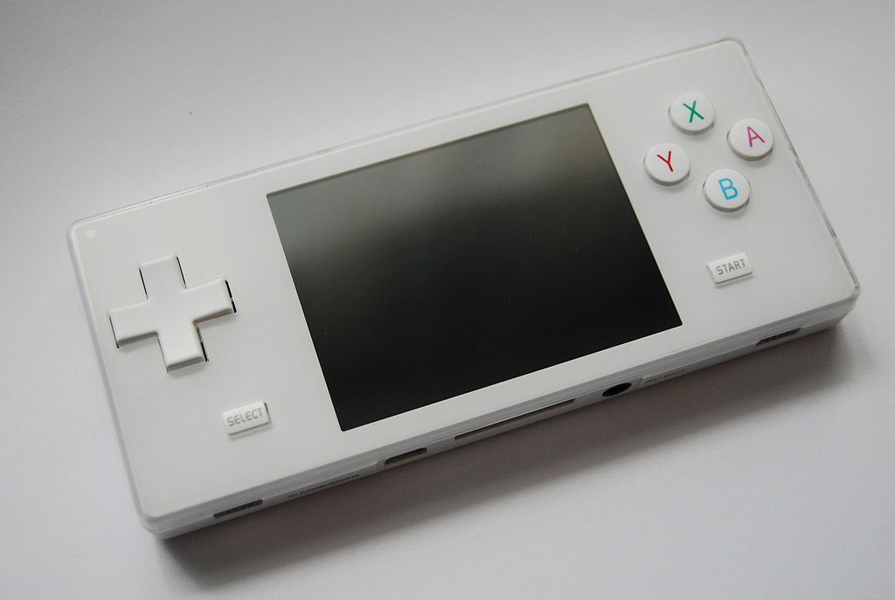

# Dingoo A320



### Features

* Portable Emulator
* File viewer (Pictures)
* Video / Audio player
* Text reader
* SWF viewer (Flash 6)

Firmware V1.03

OS: MicroC/OS

## Research Begins

Downloaded the firmware file *a320.HXF*

**binwalk -Me a320.HXF**

* binwalk didn't work, so HXF is unsupported

**strings a320.HXF | head**

```
WADFxxxxxxxxx
Chinachip PMP Firmware V1.0
```

### Firmware File Structures

#### HXF Header Struct

Found at [rockbox](https://www.rockbox.org/wiki/ChinaChip)

```
typedef struct
{
   CHAR Main_Header[20];
   UINT Size;
   UINT Checksum;
   UINT Unk;
   CHAR Other_Header[32];
} HEADER;
```

#### HXF Firmware File Format Offsets

**Header - 64 bytes**

| Offset | Length | Contents |
| ------ | :------: | :-------- |
| 0x0000 | 4 | Signature | 
| 0x0004 | 4 | Unknown |
| 0x0008 | 12 | Firmware timestamp |
| 0x0014 | 4 | Achive size in bytes |
| 0x0018 | 4 | Checksum |
| 0x001c | 4 | Unknown | 
| 0x0020 | 32 | Identifier "Chinachip PMP firmware V1.0" padded with zeros |

**File entries - starting from 64 bytes onwards**

| Section | Length | Contents |
| ------- | :----------: | :-------- |
| Path Length | 4 | Size of the file path in the next section |
| File path | variable | Full file path "game\snake\common\1shenti1.s3dtex" |
| File type | 1 | 0x20 or 0x21 |
| File size | 4 | Size of file data in the next section |
| File data | variable | File data NOTE: NOT PADDED | 

### Custom Extractor - Python

```python
print s
```

#### Future work:

* Study boot sequence
* Sift through disassembly
* Look through .dl files
* Firmwalker
* Attempt emulation
